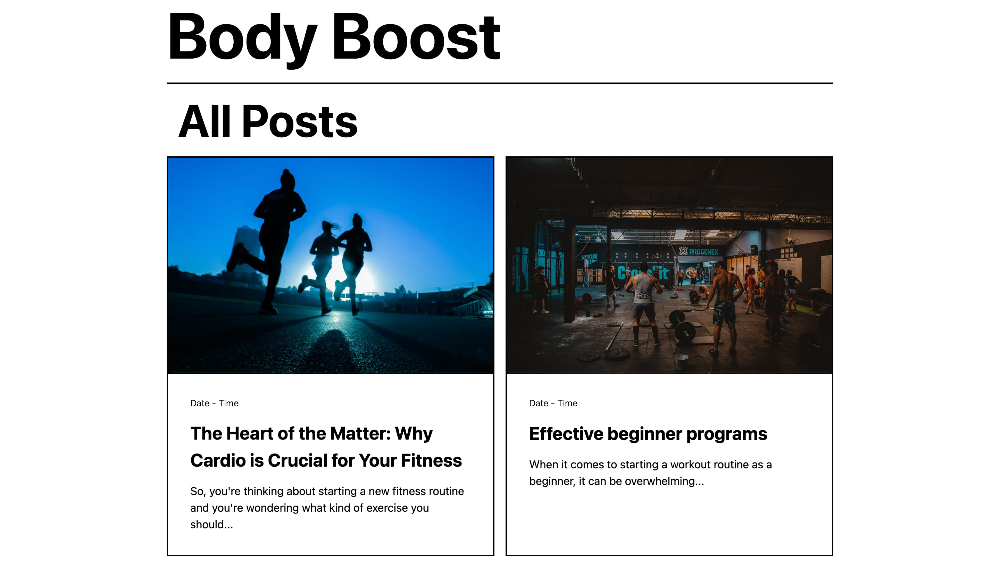
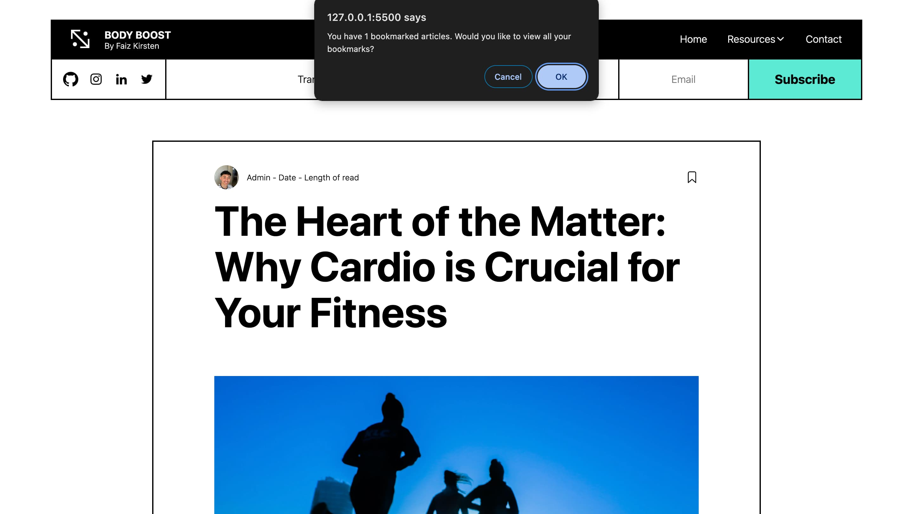
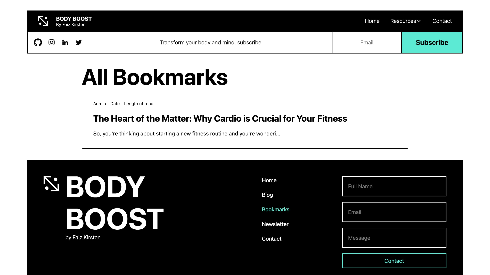

# BodyBoost Fitness Blog Website

BodyBoost Blog is a fitness-focused website showcasing articles on workouts, nutrition, and trends. Built using HTML, CSS, and JS, it offers an intuitive interface for seamless navigation. The main feature is the bookmark functionality using Local Storage in Javascript, allowing users to save articles for later reading.

## Demo

Insert gif or link to demo

## Run Locally

Clone the project

```bash
  git clone https://github.com/faiz-kirsten/body-boost-fitness-blog.git
```

## Features

-   Save articles to read later

## Screenshots




